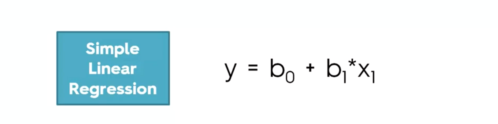
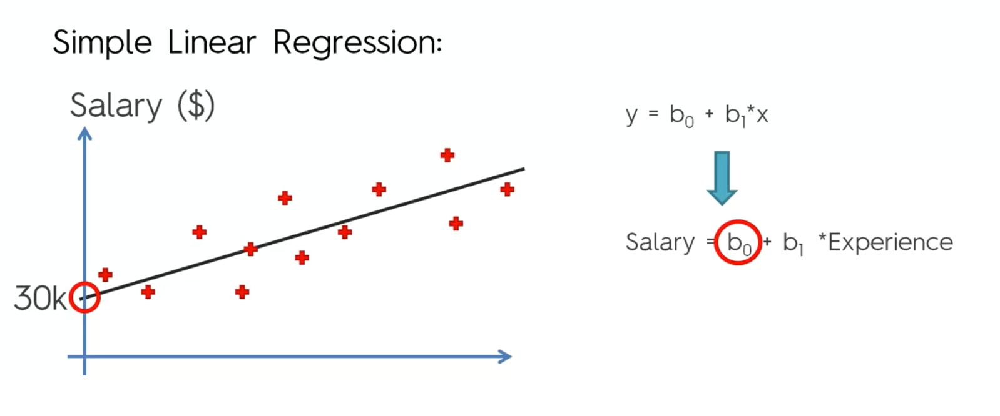
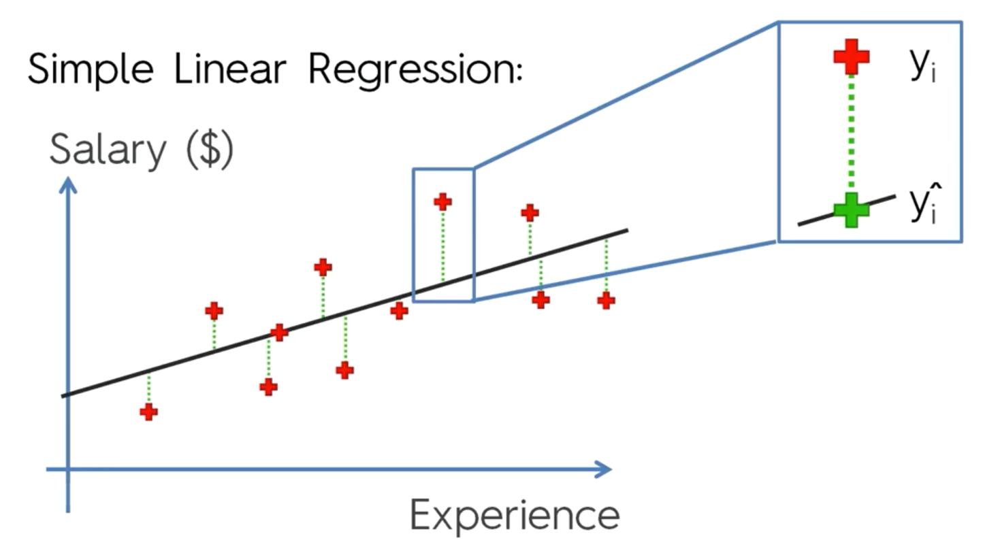
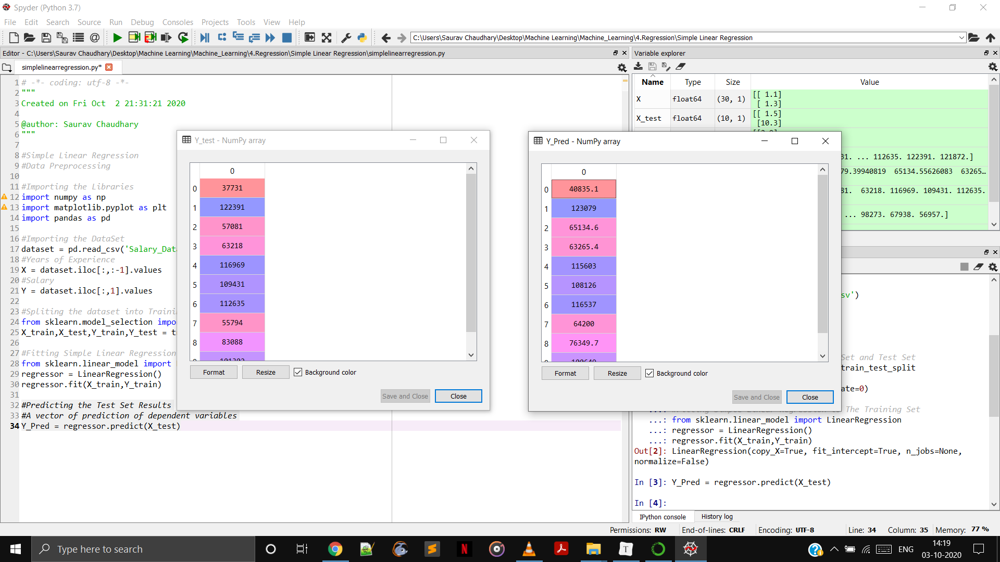
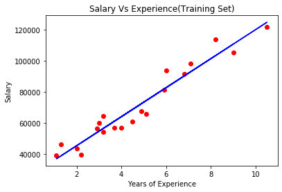
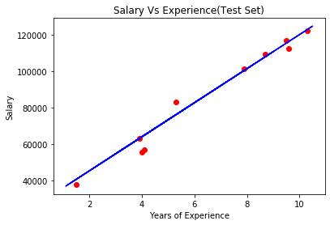

# Simple Linear Regression

The dataset contains two columns containing Years Experience and Salary. There are 30 observations in the dataset. We need to find out the co-relation between salaries and years of experience.

​			You can get the dataset [here](https://github.com/sauravchaudharysc/Regression/blob/main/Simple%20Linear%20Regression/Salary_Data.csv)

 

> **Dependent Variable**
>
> The y is dependent variable which changes . 
> For example y is the salary how does it changes with the years of experience or y is the hours of study depending on the grade of student.

> **Independent Variable**
>
> The x is independent variable. A direct or indirect factor to change the dependent variable.

> The variable b1 is a multiplier for the independent variable and b0 is the constant term


##### Let us take the dataset and draw a graph to understand it better.



When experience is zero the constant b1 turns out to be zero . So Salary = b0. So as the slope line increase salary increase as observed from the graph.

#### How to get the best line which fits the data better ?

We will use the same graph . But here we will draw vertical lines from the actual observation to the slope line. 



The red cross indicates the person salary should be according to his years of experience. But the green line shows the person salary according to slope line. The green line is the difference between the actual and predicted salary. 
So to get the best fitting line. 


We draw all possible lines and the line in which we get the minimum is the best line which fits the data.

## Implementation in Python

Pre-Requisite

- Learn [Data Pre-Processing](https://github.com/sauravchaudharysc/Machine_Learning/blob/master/3.Data%20PreProcessing/README.md)
- Set the path to the dataset folder.
- Copy the data pre-processing template we made earlier.
- Change the Data.csv to Salary_Data.csv

### Let's Begin..

#### Importing the Dataset

```python
#Importing the DataSet
dataset = pd.read_csv('Salary_Data.csv')
#Years of Experience
X = dataset.iloc[:,:-1].values
#Salary
Y = dataset.iloc[:,1].values
```

#### Splitting the Dataset

```python
#Spliting the dataset into Training Set and Test Set
from sklearn.model_selection import train_test_split 
X_train,X_test,Y_train,Y_test = train_test_split(X,Y,test_size=1/3,random_state=0)
```

> We split the dataset into training and test set. Out of 30 observations we choose 20 for training and 10 for testing.

#### Fitting Simple Linear Regression to the Training Set

```
#Fitting Simple Linear Regression to The Training Set
from sklearn.linear_model import LinearRegression 
regressor = LinearRegression()
regressor.fit(X_train,Y_train)
```

> We are going to use the specific library linear model that will do the job for us. The first line we import the library . It contains a Linear Regression class , we create a object of it i.e. a regressor object .  Using the regressor object we call a method of this class .fit which accepts the X_train and Y_train as a parameter. Here X_train is the independent variable and Y_train is the dependent variable.
>
> This will not only create a simple regressor but also it will make our model to learn the correlations between the training set and testing set of data. It learns how to predict the dependent variable which is the salary based on the information of the independent variable which is the numbers of years of experience.

#### Prediction

Our machine is trained i.e. has learned to correlation . So we will see the prediction of our trained model.

```python
#Predicting the Test Set Results
#A vector of prediction of dependent variables
Y_Pred = regressor.predict(X_test)
```



>  So we can see above , on the left side we have the original salaries and on the right side we have the predicted salaries. 
>
> Our predicted salaries arent so far from the original salary in most the cases. In some case it might get a prediction which is far from reality . 


### Visualizing the Training and Test Set

```python
#Visualising the Training set results
plt.scatter(X_train,Y_train,color = 'red')
plt.plot(X_train,regressor.predict(X_train),color='blue')
plt.title("Salary Vs Experience(Training Set)")
plt.xlabel("Years of Experience")
plt.ylabel("Salary")
plt.show()
```



```python
#Visualising the Test set results
plt.scatter(X_test,Y_test,color = 'red')
#We dont need to change this because our regressor is already trained on training set
#So doing this we will get only some new points
plt.plot(X_train,regressor.predict(X_train),color='blue')
plt.title("Salary Vs Experience(Test Set)")
plt.xlabel("Years of Experience")
plt.ylabel("Salary")
plt.show()
```

